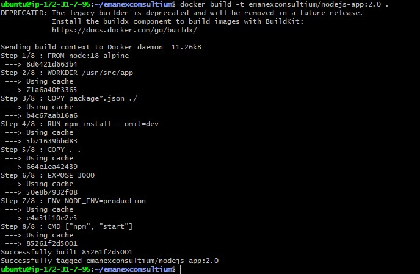
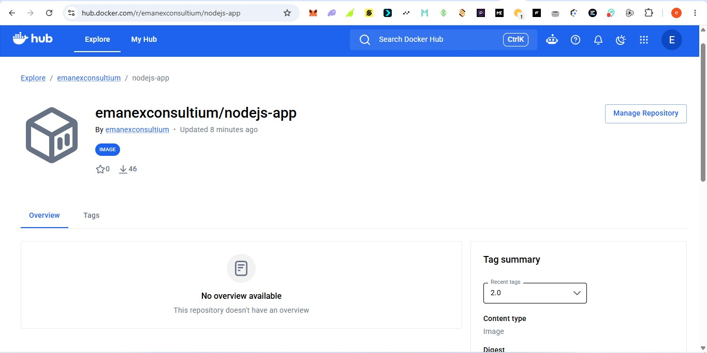
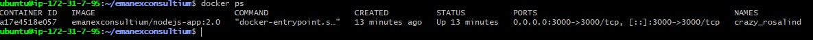
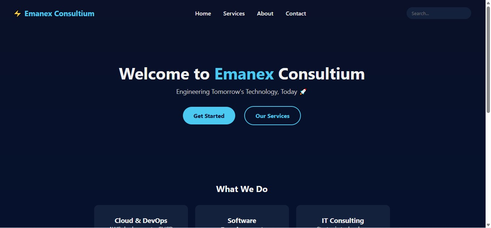

# Emanex Consultium

A Node.js application for Emanex Consultium, a technology consulting landing page, containerized with Docker and published to Docker Hub.

## Docker Build Command

The image was built from the project's Dockerfile using the following command:

```bash
docker build -t emanexconsultium/nodejs-app:2.0 .
```

Screenshot showing the build command and successful build output:



## Docker Hub Image

The image is published on Docker Hub at:
[hub.docker.com/r/emanexconsultium/nodejs-app](https://hub.docker.com/r/emanexconsultium/nodejs-app)

Pushed with:

```bash
docker push emanexconsultium/nodejs-app:2.0
```

Screenshot showing the image available on Docker Hub:



## Running Docker Container

The image was pulled and run with:

```bash
docker pull emanexconsultium/nodejs-app:2.0
docker run -d -p 3000:3000 emanexconsultium/nodejs-app:2.0
```

Verified as running with:

```bash
docker ps
```

Screenshot showing the container running:



## Live Application

The application is accessible at:

```
http://<EC2-public-IP>:3000
```

Screenshot showing the application running successfully in the browser:


